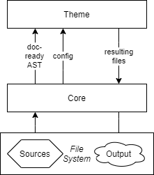

# Welcome to fliegdoc 👋

[](https://www.npmjs.com/package/fliegdoc)

[](https://fliegwerk.github.io/fliegdoc)
[](https://github.com/fliegwerk/fliegdoc/graphs/commit-activity)
[](https://github.com/fliegwerk/fliegdoc/blob/master/LICENSE)
[](https://twitter.com/pklaschka2000)

> A documentation generator for Typescript-based libraries with good support for monorepos

### 🏠 [Homepage, Demo & Docs](https://fliegwerk.github.io/fliegdoc)

## Prerequisites

- node >12.0.0

## Install

```sh
npm install --global fliegdoc
```

## Usage

### CLI

```sh
$ fliegdoc --help
Usage: fliegdoc [command] [options]

Commands:
  fliegdoc build [options]  Build the documentation       [default] [aliases: b]
  fliegdoc serve [options]  Preview the documentation in the browser[aliases: s]
  fliegdoc completion       generate completion script

Options:
      --help     Show help                                             [boolean]
  -s, --serve    Serve the static files after build   [boolean] [default: false]
  -p, --port     The port on which the documentation gets hosted        [number]
  -v, --version  Show version number                                   [boolean]

Get help for individual commands by running fliegdoc <command> --help
```

The CLI searches for a `fliegdoc.config.js` file and applies its options **on top of the default options**.

#### Example `fliegdoc.config.js` with default options

```js
// fliegdoc.config.js
const { HTMLTheme } = require('fliegdoc');

module.exports = {
	baseUrl: '/',
	outDir: './docs',
	readme: './README.md',
	modules: [
		{
			package: './package.json',
			tsconfig: './tsconfig.json',
			mainFile: 'main.ts'
		}
	],
	title: 'Documentation', // appears in the page title and header
	externalLinks: {}, // e.g.: { "GitHub": "https://github.com/fliegwerk/fliegdoc" }
	hidePrivateMembers: true,
	theme: HTMLTheme
};
```

### API

```ts
import {} from 'fliegdoc';
```

(cf. [docs](https://fliegwerk.github.io/fliegdoc/fliegdoc) for a list of exported members)

### Themes



Themes take the doc-ready AST and configuration and write a resulting file structure.

In code, themes are implemented as objects that implement the `Theme` interface. This means that they have both a
property `isBrowserViewable: boolean` and a method `onBuild()`.

The `isBrowserViewable` property should be `false` unless the theme is intended to be used in the browser (e.g.,
outputting HTML files).

The `onBuild` method is called with the doc-ready AST and configuration as arguments. As third argument, it gets passed
a `CreateFileFunction` (`( path: string, content: Buffer, mimetype: string ) => Promise<void>`), that you **must use**
to create files in the output folder. You must use that function so that any necessary cleanup can be done by fliegdoc.

The object then gets passed as `theme` in the configuration object.

A simple example theme outputting the raw AST as JSON could look like this:

```ts
// fliegdoc.config.js
// a theme that outputs the raw AST as JSON files
const theme = {
	isBrowserViewable: false, // don't use this in the browser
	onBuild(ast, config, createFile) {
		for (const module in ast) {
			// iterate over modules
			const { name } = ast[module]; // e.g. 'fliegdoc'
			const fileName = `${name}.json`; // e.g. 'fliegdoc.json'
			const content = JSON.stringify(ast[module], null, 2);

			// create the file
			createFile(fileName, Buffer.from(content), 'application/json');
		}
	}
};

module.exports = { theme /* [...] */ }; // add the theme to the configuration
```

_Please note that there may be changes to the doc-ready AST structure with new TypeScript releases,
so we can't provide detailed documentation on its structure.
We recommend studying the raw output to get a sense of how the output is structured._

## Author

👤 **Pablo Klaschka**

- Twitter: [@pklaschka2000](https://twitter.com/pklaschka2000)
- Github: [@pklaschka](https://github.com/pklaschka)
- LinkedIn: [@pklaschka](https://linkedin.com/in/pklaschka)

## 🤝 Contributing

Contributions, issues and feature requests are welcome!

Feel free to check [issues page](https://github.com/fliegwerk/fliegdoc/issues). You can also take a look at
the [contributing guide](https://github.com/fliegwerk/fliegdoc/blob/master/CONTRIBUTING.md).

## Show your support

Give a ⭐️ if this project helped you!

## 📝 License

Copyright © 2021 [Pablo Klaschka](https://github.com/pklaschka).

This project is [MIT](https://github.com/fliegwerk/fliegdoc/blob/master/LICENSE) licensed.

---

_This README was generated with ❤️ by [readme-md-generator](https://github.com/kefranabg/readme-md-generator)_
